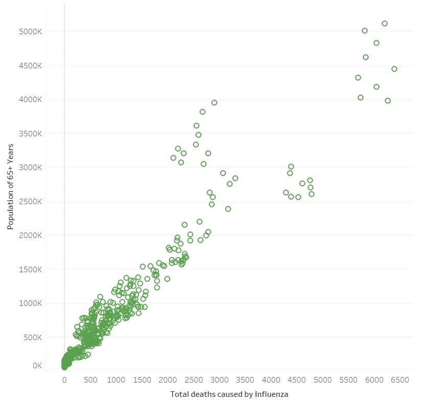
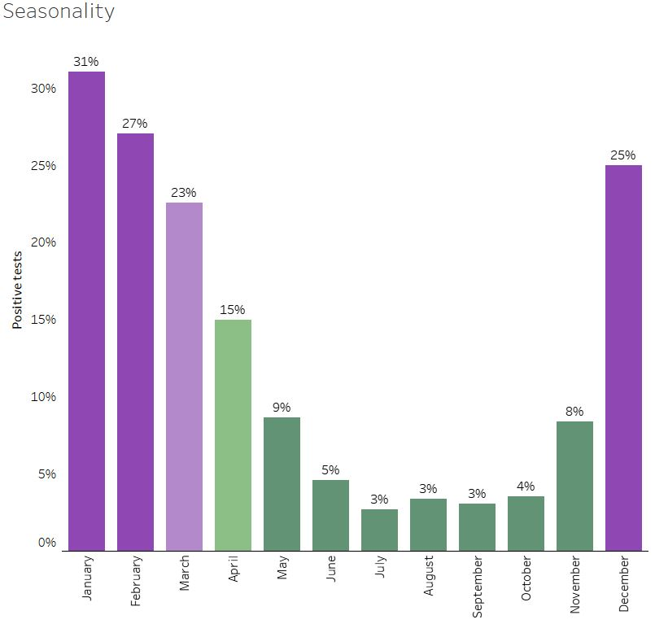
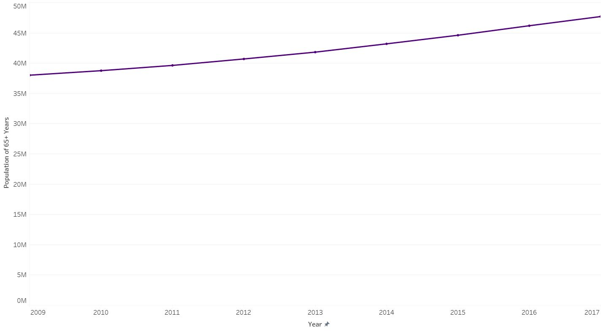
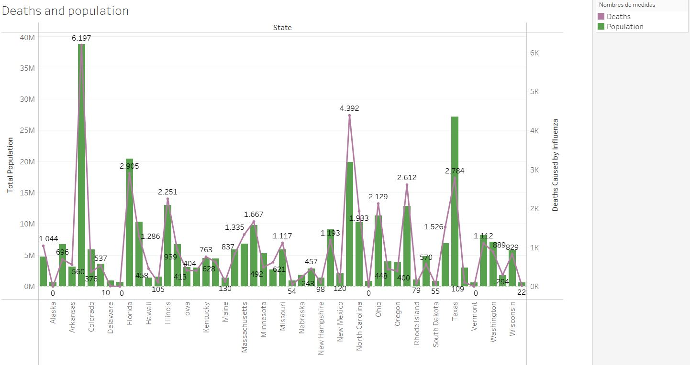
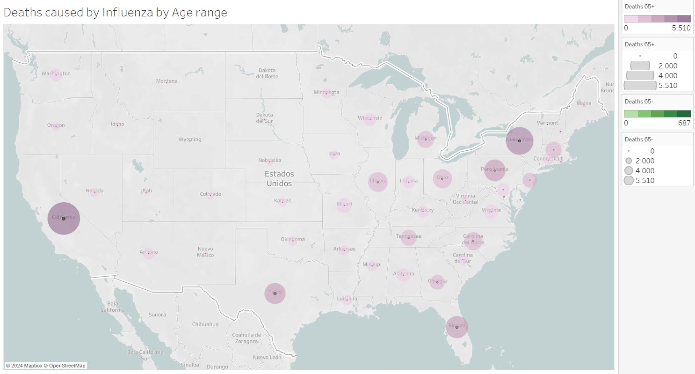
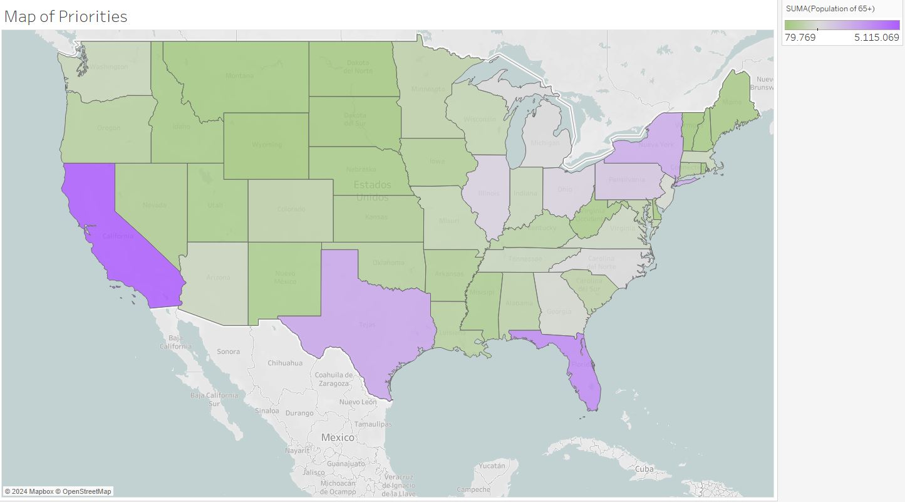

# Overview

## Introduction

United States has an influenza season where more people than usual suffer from the flu. Some people, particularly those in vulnerable populations, develop serious complications and end up in the hospital. Hospitals and clinics need additional staff to adequately treat these extra patients.

## Data Used
The data sets used are Influenza deaths by Geography, source: CDC; Population data by geography, time, age and gender, source: US Census Bureau; Counts of influenza laboratory test results by state (survey), source: CDC Flueview; and Survey of flu shot rates in children, source: CDC.

## Challenges
The data had to be cleaned, transformed and wrangled in Excel to make it more understandable and prepare it for exporting to Tableau, where the visualizations were created.

## Tools
* Excel for data cleaning and wrangling.
* Tableau for visualization.

## Questions
* Provide information to support a staffing plan, detailing what data can help inform the timing and spatial distribution of medical personnel throughout the United States.
* Determine whether influenza occurs seasonally or throughout the entire year.
* Prioritize states with large vulnerable populations. Consider categorizing each state as low-, medium-, or high-need based on its vulnerable population count.

## Skills
* Data profiling.
* Data transformation and integration.
* Conducting statistical analyses.
* Composition and comparison charts.
* Temporal visualization.
* Spatial analysis.
* Data visualization with Tableau.

## Goals
* Make a complete analysis of the company’s requirements.
* Understand business problems.
* Provide conclusions and recommendations that will help meet the requirements.
  

&nbsp;  

# Analysys

{:style="display:block;margin:0 auto"}

Deaths caused by influenza are significantly correlated with the population aged 65 and above, demonstrating a strong relationship between the two variables. This connection is rooted in the heightened vulnerability of older adults to influenza-related complications due to age-related declines in immune function and increased prevalence of underlying health conditions.

&nbsp;  

{:style="display:block;margin:0 auto"}

Influenza season typically coincides with the winter months, characterized by colder temperatures and lower humidity levels. The winter season often weakens the immune system, making individuals more susceptible to infections like influenza.

&nbsp;  

{:style="display:block;margin:0 auto"}

The population of individuals aged 65 and above is experiencing a notable increase globally, driven by factors such as improved healthcare, advancements in medical technology, and declining birth rates in many countries. While it reflects progress in healthcare and living standards, it also poses significant implications for healthcare systems, social services, and economic structures, as older adults typically require more extensive medical care and support.

&nbsp;  

|

The State of New York stands out when comparing the total population and the deaths caused by influenza.

&nbsp;  

|

California, Florida, Texas, and New York are home to the largest concentrations of individuals aged 65 and above in the United States. These states attract retirees due to various factors like favorable climates, and amenities, leading to significant population growth in this demographic. As a result, they face unique challenges related to aging populations, including healthcare demand and social support needs specific to older adults.

&nbsp;  

# Conclusion

Influenza is more deadly for people over 65 compared to those younger, largely due to weakened immune systems and higher rates of underlying health issues. This makes older adults more susceptible to severe complications like pneumonia, emphasizing the need for targeted interventions and vaccination efforts to protect them from the virus's impacts. Protecting this age range is crucial to lower deaths caused by influenza.

&nbsp;  

# Recommendation

Given that California, Florida, Texas, New York, Pennsylvania, Illinois, Ohio, and Michigan collectively house 48% of the total population aged 65 and older in the United States, it is advisable to allocate additional medical resources to these states during the winter months. This targeted allocation would help meet the heightened healthcare needs of older adults, who are particularly vulnerable to seasonal illnesses such as influenza during this time.

&nbsp;  

# Links
[Tableau Dashboard](https://public.tableau.com/app/profile/jaime.suarez4491/viz/MedicalStaffing/Story1?publish=yes)

